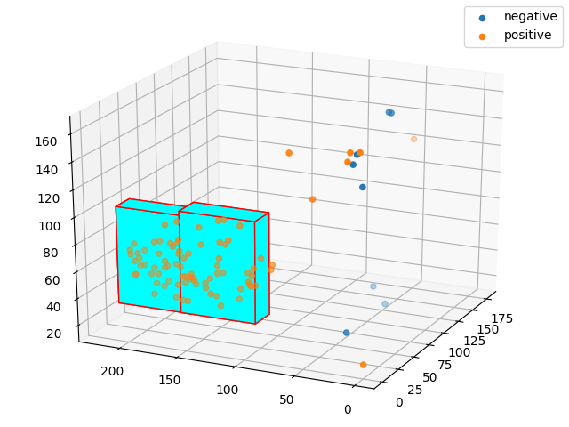

**Advanced color detecting tool for OpenCV**

When we detect color on an image in opencv we use `cv2.inRange` function like in this tutorial:  
*https://henrydangprg.com/2016/06/26/color-detection-in-python-with-opencv/*

However, sometimes accuracy of this approach is not satisfactory. Also it is usually difficult to define the range.

In this code I use multiple `cv2.inRange` calls in different regions of color space:  
  
*Points represent colors in {H,S,V} coordinates. Boxes represent ranges.*

**How it works**

This code uses pre-collected data. A simple heuristic algorithm is used here to define boxes (ranges) which fit most of the points.  
Basically you click on desired colors and then they are detected.

**Testing**

For images present here, dataset is already collected, just launch `test.py` to see how it works.

**Collecting your own color dataset**

Put your sample images to `input_data` folder.  
Make sure that `color_dataset` file is empty or deleted: this code will append samples to it.  
Run `collect_data.py`.  
Images will appear on the screen. Click left mouse button on points that contain color you want to detect.  
Click middle mouse button on colors which you don't want to detect. Negative points will not affect ranges. They are only needed if you want to see them on plot as showed above.

**Usage**

To use this code in your project you will need only `color_detector.py`.  
```Python
from color_detector import ColorDetector
```
Use color dataset from file 'color_dataset' to create detector object:
```Python
cd_green = ColorDetector('color_dataset')
```
*That's it!* Now to use the detector, call `get_mask`:
```Python
mask = cd_green.get_mask(image)
```
Now you have binary mask of image.  

**Analysis**

To see which ranges were created, write:
```Python
print(cd_green.ranges)
```
output is a list of two (in this example) ranges (they can be seen as boxes on the above picture):
```Python
[(array([  27.28966087,  160.95680175,   24.2726661 ]), array([  45.71033913,  226.04319825,   96.7273339 ])), (array([  27.12217638,  106.1456087 ,   24.15146678]), array([  47.87782362,  170.8543913 ,   99.84853322]))]
```

**Alternative usage**

If you already have ranges, you can use them as follows:
```Python
cd_green = ColorDetector()
cd_green.ranges = [(lower1, upper1), (lower2,upper2)] # where lowerI and upperI are numpy arrays representing colors
```
